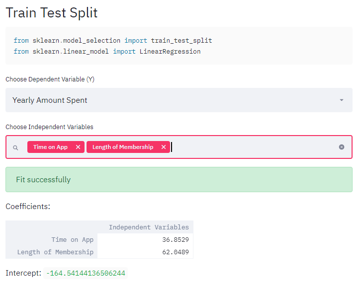

# LinearRegressionApp
This is an Interactive Linear Regression App! The structure of the app comes from one of the Udemy course projects that I had. As for the linear Regression Project, in stead of having a one-time deployment, I have decided to create a reproducible linear regression app. 

Feel free to play with the codes! 


# Installation

This repository is tested on Python 3.5+

Clone the repository


```sh
$ git clone https://github.com/CJtheSloth/LinearRegressionAPP
$ cd streamlit_LineaarRegression
```

Install the dependencies

```sh
$ pip install pandas streamlit matplotlib
```

Run the application on `http://localhost:8501/`

```sh
$ streamlit run LinearRegression.py
```

General Overview of the Iris App





